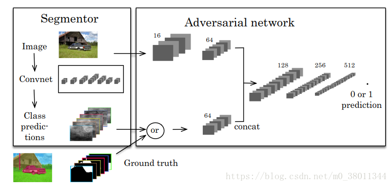
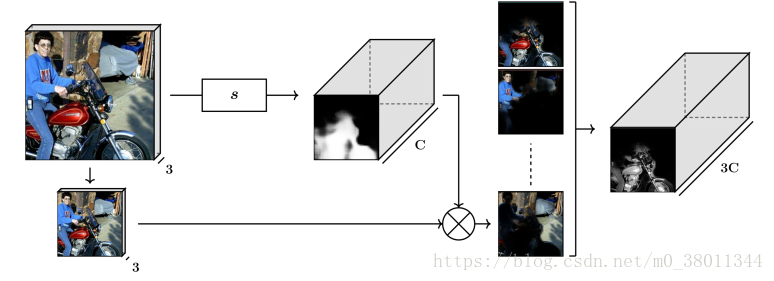
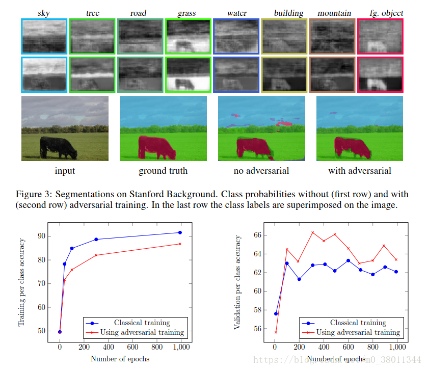

# Note-for-SegGAN
make some notes for the paper named SegGAN

论文名称: Semantic Segmentation using Adversarial Networks  
论文地址: [https://arxiv.org/abs/1611.08408](https://arxiv.org/abs/1611.08408)  

在这篇论文中，作者首次将生成对抗网络(GAN)应用到语义分割中来。整个网络的框架如下图所示，这个网络由两部分组成。左边是一个分割器，就是一个普通的分割网络，作者根据不同的数据集选用了不同的结构。对于Stanford Background dataset，作者选用了[multi-scale segmentation network](http://yann.lecun.com/exdb/publis/pdf/farabet-pami-13.pdf),
而对于Pascal VOC 2012 dataset，作者选用了[Dilated-8 architecture](https://arxiv.org/abs/1511.07122)。
右边则是一个对抗网络，相当于GAN中的判别器。输入分别是Segmentor生成的label map或者是Ground truth。为了与生成label map的resolution相匹配(经过Convnet导致分辨率下降)，Ground truth在输入进判别器之前要经过下采样。输出为0或1，0表示判别器预测为生成样本，1表示判别器预测为真实样本。通过这种对抗训练，可以使生成的label map与Ground truth保持高阶一致性(higher-order consistency)。  

```
Tips: 高阶一致性是相对于低阶一致性来说的。像L1，L2损失就属于低阶一致性，因为它统计的是单独像素之间的数值差异再累加起来，而高阶一致性倾向一种整体的连续性，使生成的图像在视觉上看起来更逼近原始图像，正如SRGAN中所说的一样。
```
  

SegGAN采用的损失函数结合了多分类交叉熵损失和对抗损失，并用一个超参数$ \lambda $来平衡这两项损失:
$$
l(\theta_s,\theta_a) = \sum_{n=1}^{N}l_{mce}(s(x_n),y_n)-\lambda[l_{bce}(a(x_n,y_n),1)+l_{bce}(a(x_n,s(x_n)),0)]
$$
其中$ x \in H\times W\times 3 $为输入图像，$ s(x) \in H\times W\times C $为分类器生成的label map(C为所有类别的总数，对于每一个类别，都会输出一张label map)，y自然就是Ground truth了。$ \theta_s $和$ \theta_a $分别是Segmentor和Adversarial network需要学习的参数。交叉熵损失定义为$ l_{mce}(y^{'},y) = -\sum_{i=1}^{H\times W}\sum_{c=1}^{C}y_{ic}lny_{ic}^{'} $，类似于负对数似然，保证低阶一致性。二值交叉熵损失定义为$ l_{bce}(z^{'},z) = -[zlnz^{'}+(1-z)ln(1-z^{'})] $，如果代入到损失函数公式里，第二项就变为了以下形式：
$$
\sum_{n=1}^{N}\lambda[ln(a(x_n,y_n))+ln(1-a(x_n,s(x_n)))]
$$
是不是很熟悉，其实它就是GAN的损失函数啊，只不过是把D换成了a，输入图像x也当作了判别器的参考输入罢了。所以，如果我们想训练判别器(Adversarial network)，就用上面的的分项(maximize)；如果想训练分割网络(Segmentor)，就用如下的分项(minimize)：
$$
\sum_{n=1}^{N}l_{mce}(s(x_n),y_n)+\lambda[ln(1-a(x_n,s(x_n)))]
$$
本文涉及到了两个数据集: Stanford Background dataset和Pascal VOC 2012 dataset。针对这两个不同的数据集，作者也使用了不同的对抗网络。对于Stanford Background dataset，作者将64-channel的RGB图像(3$\rightarrow$16$\rightarrow$64)与64-channel的label map(或Ground truth)拼接成128-channel，然后再送入到后面的Convnet里进行判别；而对于Pascal VOC 2012 dataset，我们比较了三种输入对于对抗网络的影响，分别是*Basic*, *Product*以及*Scaling*。

- *Basic*：普通的输入，即只有分割网络的输出结果。作者对比了加入RGB图像之后的结果，并没有太大的改进。选择这种输入的一个很直观的理由是，对抗网络可以根据你输入的label map中是只包含0和1或是有介于0和1之间的数来判断究竟是生成的label map还是Ground truth。
- *Product*：将RGB图片的三通道与分割器输出的C张label map分别相乘，得到3C张label map作为对抗网络的输入，具体实现过程如下图所示。
- *Scaling*：这个还没有看懂是什么意思，.......



以上讨论了不同的输入，作者也还比较了4种不同的网络的影响，分别是LargeFOV，LargeFOV-light，SmallFOV，SmallFOV-light。Large和small代表了卷积步长的大小和网络深浅的差异，进而影响感受野的大小(field-of-view)。而light则表示较之于之前的模型更轻量化的一个网络，具体表现为卷积通道数减少，这样训练起来会更有效率。


具体的实验结果如下图所示，看起来也是相当不错哦！特别是相对于没有经过对抗训练的网络，SegGAN能够更好的保证生成的label map在视觉上保持着高阶一致性。



Word and Expression：

- formulated as a dense labeling problem：语义分割是一个密集预测问题。
- a common property across all：所有共同的特征
- spatial contiguity：空间连续性                   higher-order consistency：高阶一致性
- sidestep：避免，同avoid，obviate           concurrently：同时
- in the sense that：某种意义上来说            follow-up：接下来的
- deterministic：确定性的                              perturb：打扰，干扰
- indifferently：无差别地                                rationale：理由，解释
- whereas：而，用法同while                         spurious：虚假的
- methodologically：从方法论上来说           more pronounced：更加明显的